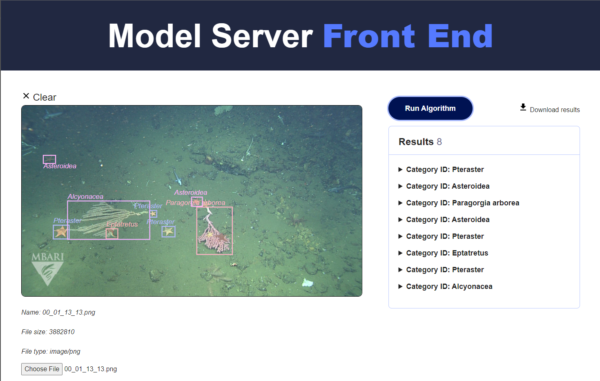

This project is a model server that accepts POSTs with images in them, as well as a model to run on those images. Currently only object detection models are supported, and the return value of the request is the list of bounding boxes and class IDs, in JSON format. There is a model server front end page, which will display the image and draw the bounding boxes on that image, for quick review. 

Some outstanding TODOs on the front end include supporting more than just object detection models, and being able to select the model as a dropdown. This will require an update on the back end to query the existing model services.

## Getting started

You will need a .env with the appropriate values filled in. The important deployment variables correspond to your host domain, host url, and host port, as well as the location of your traefik configuration folder, which you will need to have if you wish to use HTTPS. Some helpful hints about that folder. You will want to have three files, certificates.toml, fullchain.pem, privkey.pem (you don't need to keep the fullchain or privkey naming convention, but you need them to be consistent in the certificates.toml file). The certificates.toml file will contain

```toml
[[tls.certificates]] #first certificate
    certFile = "/configuration/files/fullchain.pem" # managed by Certbot
    keyFile = "/configuration/files/privkey.pem" # managed by Certbot
```

The permissions for these files should be
* certificates.toml - 664
* fullchain.pem - 600
* privkey.pem - 600

Not setting these files up correctly will result in much heartburn in using TLS.

The rest of the entries in the `.env` file are related to either the model serving parameters, Redis parameters, or specific models running. The checked in file includes examples for two model server files, and the front end is currently hard coded to use the YOLOv5 model.

## Setting up model server examples

The repository includes examples for two publicly available models related to the [FathomNet](https://fathomnet.org) project. One is based on Detectron2, and the other is based upon YOLOv5. Both of these examples require you to obtain some files that are not suitable for including in git repositories (e.g. large model checkpoint files). 

### Detectron2

For this example, you will need to download two files, and put them into the `modelserv/model_detectron2` folder. The specific files are:
* fathomnet_config_v2_1280.yaml
* model_final.pth

Both of these files are available from the [FathomNet model zoo](https://github.com/fathomnet/models) entry for this model, located [here](https://zenodo.org/record/5571043#.Yv59qC7ML9Z). 

### YOLOv5

For this example, you will need to download the [YOLOv5 repository](https://github.com/ultralytics/yolov5), and place it in the top level directory of this project. Note that it has to go there because of how Docker build contexts work. So if you have it somewhere else on your machine already, you will either have to reclone it, or if you're feeling adventurous, symlinks _might_ work. You will also need the file `mbari-mb-benthic-33k.pt` and put that into the `modelserv/model_yolov5` folder. You can get this file from the [FathomNet model zoo](https://github.com/fathomnet/models) entry for this model, located [here](https://zenodo.org/record/5539915#.Yv6gvS7ML9Y).

## Adding a new model example

Docs coming soon...

## Running without a GPU

If you wish to run your models without a GPU (the YOLOv5 example can probably run fast enough, but not the Detectron2 one as configured), you will need to modify `docker-compose.yml` to remove the gpu resources. You can remove the entire `deploy` section, and it _should_ work (let me know in issues if it doesn't).

## Spinning up using docker-compose

Launch on localhost using docker-compose:
```bash
cd model-server-fast-api
docker network create traefik-public
docker-compose up --build
```
You can scale services to be able to handle more requests by using --scale modelserv=N --scale fast=M. Experimentally you want more web servers (fast) than model servers because the model takes a little while to process. 

Browser Windows:
- https://your_domain.com:8080/dashboard
- https://your_domain.com:port_number

The model server front end is a very lightweight submission and viewing of results front end for object detection. This will be expanded in the future.

Test curl commands:
```bash
curl -k https://your_domain.com:port_number/

cd images
time curl -X POST 'https://your_domain.com:port_number/predictor/' -H "accept: application/json" -H "Content-Type: multipart/form-data" -F "model_type=image_queue_yolov5" -F "file=@00_01_13_13.png;type=image/png"
```

Test simple-request.py
```bash
docker exec -it fast bash
cd /script/
python3 simple_request.py
```

Stress test will probably want to run outside of a container, because it will only submit to the server you're running it from. In this case, make sure the url and port are right.
```
python3 stress_test.py
```

## Application Organization

The structure of this application is to create a web server that handles incoming model requests, and model workers that process those requests. The link between these parts is a redis instance. Requests get routed to queues based on the desired model, and the model workers continually query the proper queue for work. Each requests is given a unique id, and this id becomes a key in redis that the model worker populates with results when finished. The web server continually monitors for that key and then populates the HTTP response with results once it is received. Practically speaking this means there is a limit on the duration that an algorithm can take before a response times out. This conops is not the most robust, but it does accommodate a large amount of use cases. Further work could extend to asynchronous processing with persistent connections or notifications of job completion, but this starts to overlap with other tools that tend to be much better that those types of tasks.

Typically the docker container contains code to run an algorithm architecture, and specific model parameters such as weight files and class names need to be copied into the folder before launching/building the container. It is considered bad practice to check these into the repository, so they are usually made available elsewhere. This codebase has primarily been used for experiments with the [FathomNet](https://fathomnet.org) project, and uses examples from the [FathomNet Model Zoo](https://github.com/fathomnet/models). The model zoo has links to the required files to run some of the example architectures in this repository.

TODO

- Add score thresholding
- Configure CPU/GPU
- Add health checks. Consider https://pypi.org/project/fastapi-health/